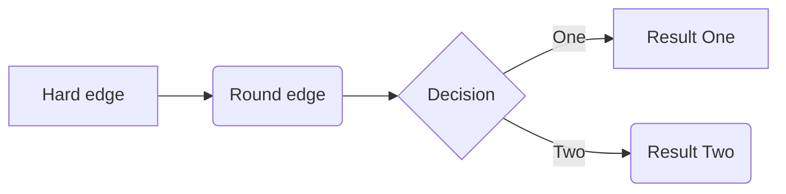

# topra 语法

[TOC]


> yingyong
>
> > yingyong

# 代码行

`单行代码`

```
多行代码
int a = 10;
```
# 序列表

* 无序列表

+ 无序列表2

- 无序列表3

* 多行无序列表1
  * 多行无序列表2
    * 多行无序列表3


1. 有序列表1
2. 有序列表2
3. 有序列表3


4. 多行有序列表1
5. 多行有序列表2
  1. 多行有序列表2-1
  2. 多行有序列表2-2
6. 多行有序列表3
  1. 多行有序列表3-1


# 表格

| 姓名 | 性别 | 年龄 | 手机号      |
| ---- | ---- | ---- | ----------- |
| 张三 | 男   | 22   | 12345676543 |
| 李四 | 女   | 23   | 124354364542 |
| 王五 | 男 | 22 | 345334253454 |
# 插入图片


# 下划线和删除线

<u>本地图片要写当前目录下，相对目录，要不然生图片显示不出来。</u>

~~删除线~~

# 超链接

[超链接][https://www.baidu.com]

[CSDN][CSDN网址]

[CSDN网址]:https://www.csdn.net

<https://github.com>

https://www.baidu.com

# 字体

*斜体*

_斜体_

**加粗**

__加粗__

# 分割线

***

---

___

# 脚注

Typora[^1]

# 符号输入和特殊符号

> 符号的输入，需要反斜线来转义

\\

\~

\_

&copy;      版权 
&reg;       注册商标 
&trade;     商标 
&nbsp;      空格 
&amp;       和号 
&quot;      引号 
&apos;      撇号 
&lt;        小于号 
&gt;        大于号 
&ne;        不等号 
&le;        小于等于 
&ge;        大于等于 
&cent;      分 
&pound;     磅 
&euro;      欧元 
&yen;       元 
&sect;      节 
&times;     乘号 
&divide;    除号 
&plusmn;    正负号

# 制表



[^1]: A markdown editor

